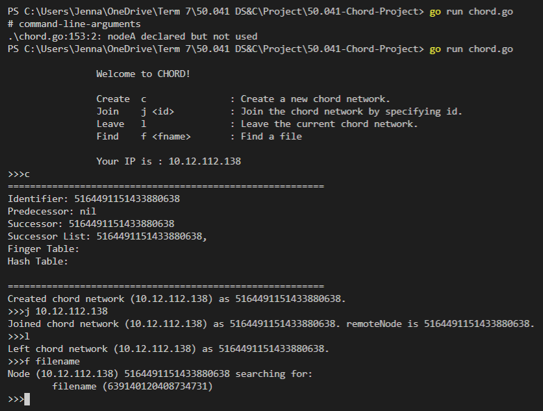

# Chord Implementation on Docker

**Command Line Interface**


**Installing Docker Compose (Linux):**
1. Run this command to download Docker Compose:
```
sudo curl -L "https://github.com/docker/compose/releases/download/1.25.4/docker-compose-$(uname -s)-$(uname -m)" -o /usr/local/bin/docker-compose
```
2. Apply executable permissions:
```
sudo chmod +x /usr/local/bin/docker-compose
```
*Installation instructions from [Docker Compose](https://docs.docker.com/compose/install/)*

**Setting up nodes:**

Build the image:
```
docker-compose pull
```
```
docker-compose build
```

Run the compose file:
```
docker-compose up -d --scale node=5
```
This creates 1 root node, and 5 other nodes.

**Viewing containers:**

To view all containers:
```
docker ps
```

To view the IP addresses of containers:
```
docker inspect -f '{{.Name}} - {{range .NetworkSettings.Networks}}{{.IPAddress}}{{end}}' $(docker ps -aq)
```

**Executing .go file in container:**

To enter a container's environment:
```
docker exec -it <CONTAINER ID> bash
```
Then run the .go file:
```
go run <FILE>.go
```

# Test Cases
**Clear ALL docker container resources**
'''
bash clear.sh
'''

**Run test cases in local machine:**
```
go test -run TestX.go
```
where X is the # of test case
eg. go test -run Test1.go

**Run test cases in Docker containers:**
'''
bash testX.sh
'''
where X is the # of test case
eg. bash test1.sh

*Note: Each test case begins with 5 nodes already set up in a chord ring.*

**Test Case #1:** New node joins when lookup is ongoing.
1. When Node A joins the ring and requests for a successor list from its immediate successor Node B, Node B does not return Node A the successor list until the lookup is complete.
2. After the lookup is complete, Node B returns Node A the successor list, allowing Node A to join the ring.

**Test Case 2:** Node leaves when lookup is ongoing.
1. A timeout is set when querying the next node. When the timeout is reached, the node sending the query resends it to the next node in its successor list instead. The lookup can then proceed to completion.
2. After the lookup is complete, the successor lists of the nodes are updated to account for the failed node.

**Test Case 3:** Node joins just as its immediate successor fails.
1. Node A joins the ring with Node B as its immediate successor; however, Node B fails and doesn't respond to Node A.
2. When Node A doesn't receive the successor list from Node B after a timeout is reached, Node A looks for other IP addresses to join. 
